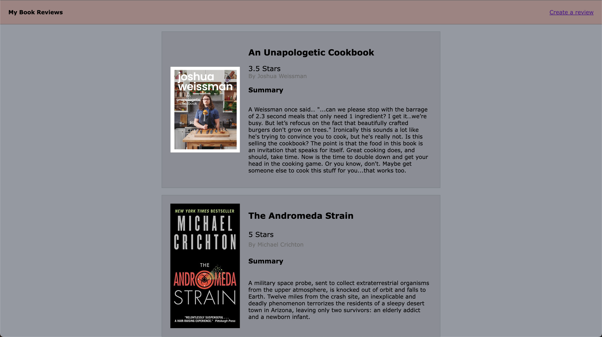
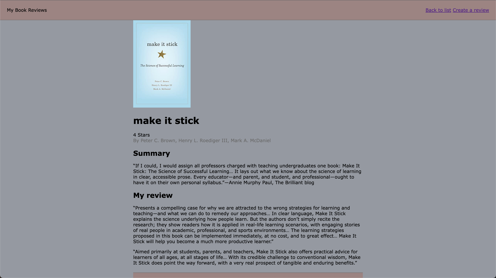
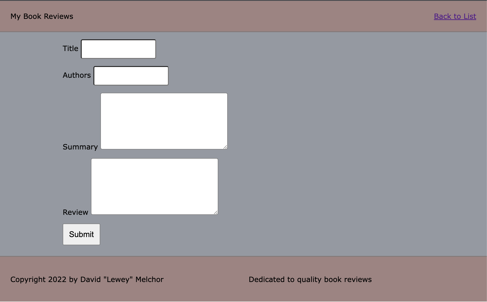

# Book-Review

## Description:
A basic web page to add reviews to books.

## Project Goals:
learn to work with HTML and CSS to build a simple book review web page.

- I utilized HTML's the fundamental five to neatly code html files keeping focus on proper formatting
    - <!DOCTYPE html>
    - html
    - head
    - title
    - body

- I used my knowledge of css selectors to style multiple html documents at once
    - class .
    - id #

- I used css to align book cover and its detailed components into two columns
    - display: grid;
    - grid-template-columns: 1fr 1fr;
    - align-self: center;

## Start it up
- command click the main file
- choose open in live server

### Main Page

### Detail Page

### Create Page

### Latest Updates:
- added create page with forms to allow client to add a review

## Created By:

|Name|Email|GitHub|
|----|-----|-------|
|David "Lewey" Melchor|dlmelchor12@gmail.com|https://github.com/leweymelchor|
